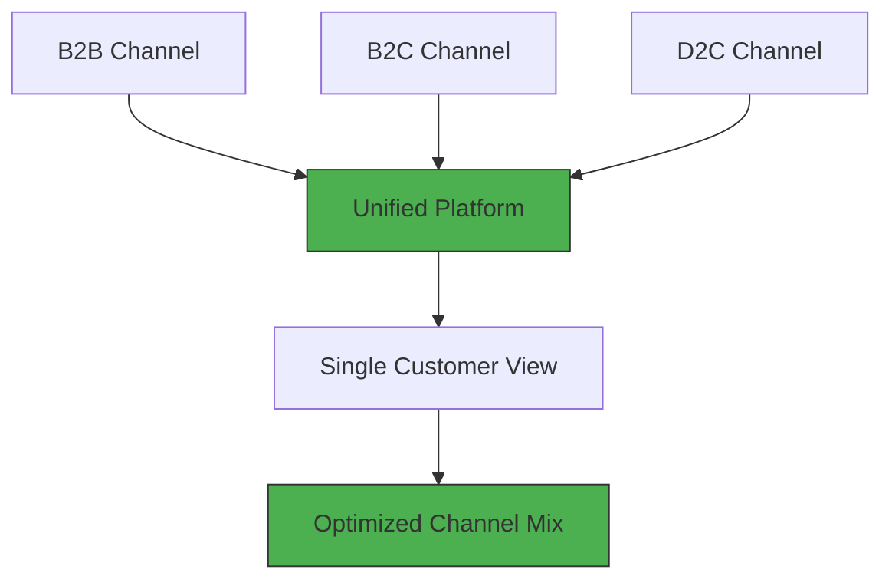

# 📊 Multi-Channel Revenue Optimization — B2B, B2C & D2C Integration

---

## 📋 Executive Summary

A multi-channel organization operating across B2B, B2C, and D2C channels was experiencing channel cannibalization, inconsistent pricing, and high customer acquisition costs.

By building a unified data model, consolidating customer data into a single source of truth, and creating channel-specific acquisition strategies with a common governance framework, the organization significantly reduced acquisition costs, increased deal sizes, and improved overall revenue velocity.

> **Why this matters to a business:** Multi-channel organizations often lose value due to fragmentation. This case study demonstrates how channel integration drives revenue efficiency and sustainable growth.

---

## 🎯 The Challenge

- **Channel cannibalization:** B2C offers were competing with D2C campaigns
- **Inconsistent pricing:** Different pricing across channels led to customer confusion
- **Fragmented customer data:** No unified view of customers across channels
- **High acquisition costs:** Rising customer acquisition costs across all channels
- **Inefficient marketing spend:** Significant budget wasted on overlapping campaigns

**The Stakes:** The organization was losing substantial potential revenue to channel conflict and inefficiency. Leadership identified channel optimization as a top strategic priority.

---

## 🛠️ My Approach

### Phase 1: Data Unification (Weeks 1-4)
1. Audited data sources across all channels (B2B, B2C, D2C)
2. Built a unified customer data model with a single customer ID
3. Integrated all sources into a single Salesforce instance
4. Created a master channel attribution framework

### Phase 2: Channel Strategy Optimization (Weeks 5-10)
1. Defined distinct value propositions for each channel
2. Implemented channel-specific pricing models with guardrails
3. Built automated workflows to prevent channel conflict
4. Created channel contribution P&L for performance tracking

### Phase 3: Governance & Continuous Optimization (Weeks 11-14)
1. Established weekly channel performance reviews
2. Implemented dynamic budget allocation based on channel ROI
3. Built customer journey analytics across channels

---

## 📊 Results & Impact

| Metric | Before | After | Improvement |
|--------|--------|-------|-------------|
| **D2C Acquisition Cost** | High | **Significantly Reduced** | Notable decrease |
| **B2B Average Deal Size** | Baseline | **Larger** | Notable increase |
| **Overall Revenue Velocity** | Baseline | **Faster** | Significant improvement |
| **Channel Conflict Resolution** | 3+ days | **~4 hours** | ~95% reduction |
| **Marketing Efficiency** | Low | **High** | Major improvement |

---

## 📈 Channel Integration Framework

---

## 💡 Key Learnings

1. **Data Unification is the Foundation:** Without a single customer ID, channel optimization is impossible. The unified data model was the most valuable investment.

2. **Distinct Value Propositions Win:** Trying to serve B2B, B2C, and D2C with the same message dilutes all channels. Each channel needs its own strategy.

3. **Governance Prevents Cannibalization:** Clear rules about channel jurisdiction and pricing prevented internal competition and preserved margins.

4. **Dynamic Budget Allocation is Required:** Fixed budgets across channels lead to waste — reallocate based on ROI performance to maximize returns.

---

## 📂 How to Explore This Project

1. **View the Data:** Navigate to the `/Data` folder to access channel performance data
2. **Explore the Methodology:** The `/Methodology` folder contains the channel strategy framework
3. **Review Visuals:** The `/Visuals` folder includes integration diagrams and dashboard mockups

---

## 🛠️ Tools & Technologies Used

| Tool | Purpose |
|------|---------|
| **Salesforce** | Unified customer data platform |
| **Oracle** | Financial and operational data |
| **Excel** | Channel performance modeling |

---

## 🏆 Skills Demonstrated

- ✅ Multi-channel strategy design
- ✅ Data unification and integration
- ✅ Channel performance management
- ✅ Budget optimization and allocation
- ✅ Customer journey analytics
